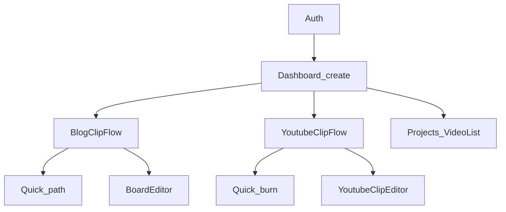
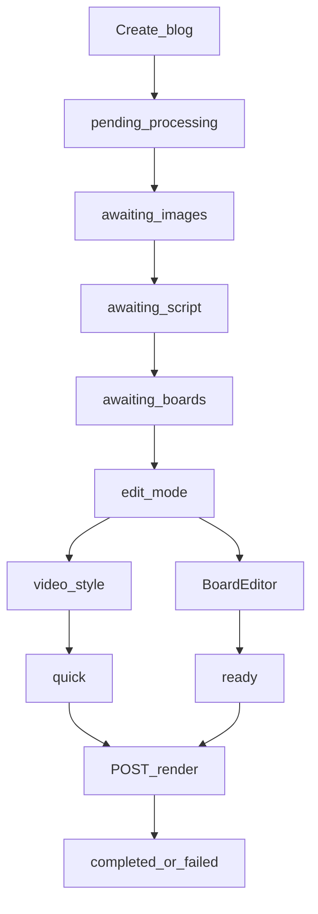
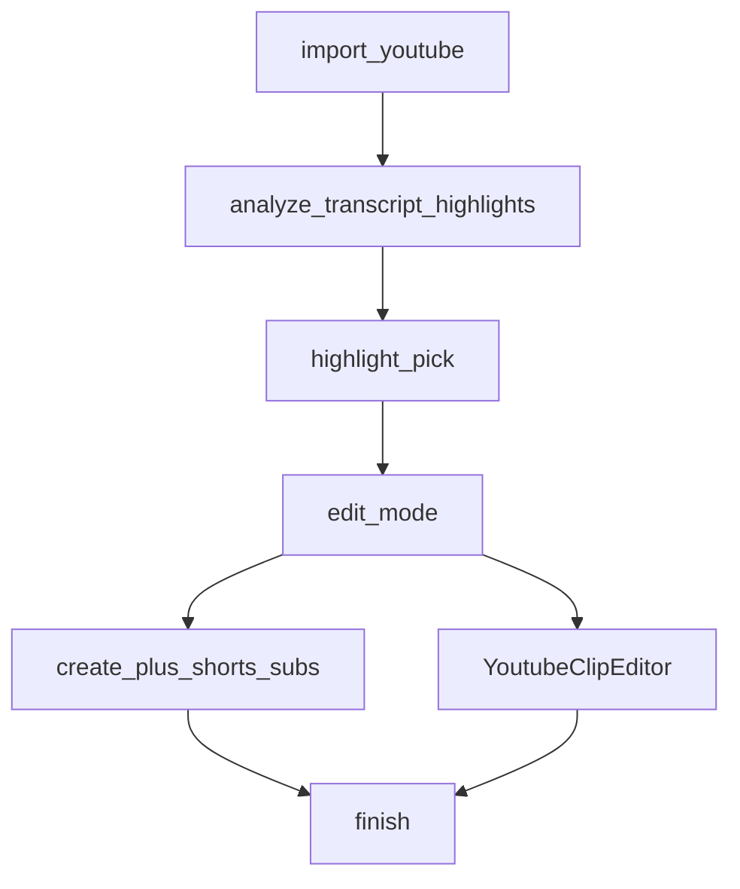

# User Journeys — New Cut

| | |
|---|---|
| **Audience** | 프로세스·UX 개선을 논의하는 AI / 사람 |
| **Snapshot** | 2026-07 (frontend UX = source of truth) |
| **Out of scope** | API 스키마 상세, Remotion/FFmpeg 내부, 배포·인프라 |
| **Related** | [ARCHITECTURE.md](ARCHITECTURE.md), [API_SPEC.md](API_SPEC.md), [PROJECT_STATUS.md](PROJECT_STATUS.md), [WIZARD_DESIGN.md](WIZARD_DESIGN.md) (**일부 스태레** — 아래 참고) |

이 문서는 **현재 구현된 사용자 여정**만 적는다. 목표 설계와 섞지 않는다.  
다른 AI가 개선안을 낼 때는 §8 관찰점과 각 Journey의 분기·성공 조건을 기준으로 삼으면 된다.

> **스태레 주의:** `WIZARD_DESIGN.md`는 블로그 위자드 설계안이며, 보드→보이스→스타일 **선형** 서술을 남긴다. 실제 제품은 `awaiting_boards`에서 **퀵 / 세부 편집 포크**(`edit_mode`)이다. 유튜브 가이드 플로우는 `WIZARD_DESIGN.md`에 없다.

---

## 1. 글로벌 IA

### 1.1 로그인 이후 셸

1. `login` / `register` → JWT (`localStorage`) → `dashboard`
2. Dashboard 탭 (`StudioTab`):
   - `create` — 만들기 (CreateStudio)
   - `projects` — 프로젝트 (shorts / videos / clips)
   - `usage` — 요금제 (MembershipPage)

### 1.2 App 전체 화면 우선순위

[`App.tsx`](../frontend/src/App.tsx)가 아래 순서로 **한 화면만** 렌더한다.

1. `editingYoutubeClip` → `YoutubeClipEditor`
2. `editingBlogClip` + status `awaiting_boards` → `BoardEditor`
3. `focusYoutubeVideo` → `YoutubeClipFlow`
4. `focusBlogClip` → `BlogClipFlow`
5. 그 외 → `Dashboard`

### 1.3 URL 해시

| 해시 | 의미 |
|------|------|
| `#/studio/create\|projects\|usage` | 스튜디오 탭 |
| `#/shorts/{id}` | 블로그 쇼츠 플로우 포커스 |
| `#/shorts/{id}/edit` | 블로그 BoardEditor |
| `#/videos/{id}` | 유튜브·MP4 가이드 플로우 (`YoutubeClipFlow`) |
| `#/clips/{id}/edit` | 유튜브·MP4 세부 편집 (`YoutubeClipEditor`) |

블로그 해시 형태는 유지한다. 유튜브/MP4는 위 경로로 새로고침·뒤로가기가 복원한다.



---

## 2. Journey A — 블로그 → 쇼츠

**진입:** CreateStudio 소스 `blog` → “쇼츠 만들기” → `POST /blog-clips` → `focusBlogClip` → `BlogClipFlow`

**핵심 컴포넌트:**  
`CreateStudio.tsx`, `BlogClipFlow.tsx`, `ImageSelectStep.tsx`, `VideoStyleStep.tsx`, `QuickSettingsStep.tsx`, `BoardEditor.tsx`, `BlogClipCard.tsx`, `CompletedShortPlayer.tsx`

### 2.1 생성 시 옵션 (Step 0)

| 필드 | 값 |
|------|-----|
| `target_length` | `short` \| `long` |
| `narration_language` | `original` \| `ko` \| `en` \| `ja` |
| `style` (자막) | `basic` \| `bold` \| `shorts` |
| `script_model` | `gpt-4o-mini` \| `gpt-4o` (UI상 임시) |

### 2.2 서버 status → UI

| `BlogClipStatus` | 사용자 화면 |
|------------------|-------------|
| `pending` / `processing` | 준비/렌더 진행 바 (`progress` 스텝) |
| `awaiting_images` | 이미지 선택 (최소 3 · 최대 8) |
| `awaiting_script` | 대본 톤 선택 |
| `awaiting_boards` | 편집 포크 + 퀵/세부 |
| `completed` | 완료·재생·다운로드 |
| `failed` | 실패 메시지 |

**사이드 스테퍼 라벨** (`FLOW_STEPS`): `progress`(준비) → `images` → `script` → `edit` → `done`

**progress_stage (대략):**  
`queued` → `scraping` → `downloading_images` → `generating_script` → `awaiting_images` → `awaiting_script` → `awaiting_boards` → (렌더) `synthesizing_audio` → `rendering_video` → `burning_subtitles` → `done`

Phase-2 렌더 UI: status가 `pending`/`processing`이고 `progress_percent >= 55` 이거나 stage가 synthesizing/rendering/burning일 때 “렌더 중”.

### 2.3 대본 톤

`summary` | `hook` | `detailed` — 선택 후 보드 생성 → `awaiting_boards`

### 2.4 `awaiting_boards` — wizard_step

| `WizardBoardsStep` | UI | 다음 |
|--------------------|----|------|
| `edit_mode` | 퀵 모드 / 세부 편집 | 분기 |
| `video_style` | 비주얼 스타일·타이틀 | → `quick` |
| `quick` | 보이스·속도·BGM/SFX | → 렌더 |
| `ready` | BoardEditor “편집 완료” 후 확인 | → 렌더 |

레거시 저장값 `boards` \| `voice` \| `style` → 클라이언트에서 `edit_mode`로 정규화.



### 2.5 성공에 가까운 신호

- `completed` + 재생 가능 스트림 / `video_path` 또는 `subtitled_video_path`
- 다운로드 `GET /blog-clips/{id}/download`
- 메타데이터(제목 후보·설명·해시태그)
- 버전: `all_tones` / `boards` 등 (Projects·카드에서)
- **크레딧:** 블로그 스크랩·보드 편집·미리보기·최종 렌더는 현재 `monthly_usage`를 올리지 않음 (비디오 Analyze와 별개)
- 엔진: Remotion 우선, 실패 시 FFmpeg 폴백 가능 (`render_spec`으로 UI 경고)

---

## 3. Journey B — 유튜브 → 클립

**진입:** CreateStudio 소스 `youtube` → “클립 만들기” → `POST /videos/import-youtube` → `focusYoutubeVideo` → `YoutubeClipFlow`  
(Projects 목록으로 보내지 않고 가이드 플로우로 바로 전환)

**핵심 컴포넌트:** `YoutubeClipFlow.tsx`, `YoutubeClipEditor.tsx`

### 3.1 사이드 스테퍼

`progress`(추출) → `highlights`(선택) → `edit_mode`(편집) → `finish`(완료)

### 3.2 자동 파이프라인 (포커스 시 클라이언트 연쇄)

1. 필요 시 분석 — video: `uploaded` → `extracting_audio` → `audio_extracted` (실패 시 `failed`)
2. 필요 시 전사 — video → `transcribed` (transcript: `transcribing` \| `transcribed` \| `failed`)
3. `GET /videos/{id}/highlights` — 점수 상위 **최대 4개** + 썸네일
4. 사용자 1개 선택 → `edit_mode`

하이라이트 길이는 서버에서 약 15–60초를 목표로 하며, 짧은 영상은 완화·전사 폴백이 있다.

### 3.3 편집 분기

| 모드 | 동작 |
|------|------|
| 퀵 모드 | `POST /clips/create` → 자막 스타일 `shorts` 번인 → `finish` |
| 세부 편집 | 클립 생성(없으면) → 전체 화면 `YoutubeClipEditor` (미리보기·자막·TTS·메타·다운로드) |

클립 status: `pending` \| `processing` \| `completed` \| `failed`



### 3.4 성공에 가까운 신호

- 클립 `completed` + 다운로드(자막본 우선)
- 선택적 AI 나레이션 / 메타데이터
- **크레딧:** 비디오 **분석(Analyze) 성공** 시 +1 (import만으로는 차감 안 함)

같은 영상은 Projects → videos에도 남아 고전 VideoList로 재작업 가능하다.

---

## 4. Journey C — MP4 · 고전 VideoList

**진입:** CreateStudio 소스 `mp4` → 업로드 → **유튜브와 동일하게** `focusYoutubeVideo` → `YoutubeClipFlow`  
(Projects → videos의 고전 `VideoList`는 재작업용으로 유지)

**핵심 컴포넌트:** `YoutubeClipFlow.tsx` (첫 경로), `VideoList.tsx` / `HighlightList.tsx` / `ClipSummary.tsx` (Projects 재작업)

### 4.1 수동 순서

1. **분석** — 오디오 추출  
2. **음성 인식** — 전사  
3. **하이라이트 추천** — (미완료면 분석·전사를 먼저 자동 연쇄할 수 있음)  
4. 하이라이트별 **클립 생성** → 자막 / 나레이션 / 메타 / 다운로드 (`ClipSummary`)

스테퍼 없음. 인라인 리스트 UX.

### 4.2 Journey B와의 관계

| | YouTube 가이드 (B) | MP4 첫 경로 / VideoList (C) |
|--|-------------------|---------------------|
| 첫 화면 | `YoutubeClipFlow` | 업로드 후 동일 `YoutubeClipFlow` |
| Projects 재작업 | VideoList 가능 | VideoList·ClipSummary |
| 하이라이트 선택 | 썸네일 그리드 | 동일(가이드) / 텍스트 카드(VideoList) |
| 퀵/세부 | 있음 | 가이드에서는 있음 |
| 세부 편집기 | `YoutubeClipEditor` | 동일 |

---

## 5. Journey D — 프로젝트 재개

**진입:** Dashboard → `projects`

| 뷰 | 내용 | 이어하기 |
|----|------|----------|
| `작업 중` | 미완료 블로그 + 완료 클립 없는 영상 | 블로그 → Flow/보드 편집; 영상 → `YoutubeClipFlow` (`#/videos/{id}`) |
| `완료` | 완료 블로그 쇼츠 + 완료 클립 | 블로그 → 결과 Flow; 클립 → `YoutubeClipEditor` (`#/clips/{id}/edit`) |
| 소스 필터 | 블로그 / 유튜브 / MP4 | 목록만 좁힘 (어댑터, 새 테이블 없음) |
| `고급` | 고전 `VideoList` + `ClipsLibrary` | 단계별 재작업용 |

결과 액션(다운로드·메타·다시 편집)은 Flow 완료 화면의 `ResultActionsCard`에 모은다.

해시: 블로그 `#/shorts/{id}`, 유튜브·MP4 `#/videos/{id}` / `#/clips/{id}/edit`.

---

## 6. Journey E — 요금제 · 크레딧

**진입:** Dashboard → `usage` → `MembershipPage`  
플랜 카탈로그: `membershipPlans.ts` — Free / Lite / Pro (**표시용**; 셀프 업그레이드·결제 미연동)

| 플랜 | 서버 월 한도 (`usage_service`) | 최대 원본 길이(Analyze) |
|------|-------------------------------|-------------------------|
| free | 3 | 10분 |
| lite | 30 | 30분 |
| pro | 150 | 120분 |

멤버십 페이지 마케팅 카피(`membershipPlans.ts`)의 “월 크레딧 5/40/200” 등은 **서버 한도와 숫자가 다를 수 있음** — 표시용.

**크레딧(+1) 시점 (현재 구현, 코드 기준):**

- 비디오 **Analyze** 성공 시 `increment_monthly_usage` 1회뿐

차감하지 않는 예: 블로그 생성·렌더 전체, 유튜브 import만, 전사/하이라이트/클립 자르기·자막(분석이 이미 끝난 뒤).

---

## 7. 성공 기준 체크리스트

### 블로그 쇼츠

- [ ] Phase-1: 이미지 확정 → 톤 선택 → `awaiting_boards`
- [ ] 퀵 또는 세부 경로로 렌더 시작
- [ ] `completed` + 인앱 재생
- [ ] MP4 다운로드
- [ ] (선택) 메타데이터·버전·활성 버전

### 유튜브 / 클립

- [ ] 하이라이트 후보 표시·선택
- [ ] 클립 `completed`
- [ ] (퀵) 쇼츠 자막 적용 또는 (세부) 편집기에서 자막/음성
- [ ] 다운로드

### 멤버십

- [ ] 사용량 칩에 remaining 반영
- [ ] 한도 초과 시 **Analyze** 거부 메시지 (블로그 렌더는 현재 이 한도로 막지 않음)

---

## 8. 개선 논의용 관찰점 (현상만)

다른 AI가 프로세스 개선을 제안할 때 우선 검토할 **현재 상태**이다. 해결안은 이 문서에 적지 않는다.

1. **유튜브·MP4 플로우 해시** — `#/videos/{id}`, `#/clips/{id}/edit`로 복원 (블로그 `#/shorts/...` 유지)  
2. **MP4 첫 경로 = 가이드** — CreateStudio 업로드는 YoutubeClipFlow; 고전 VideoList는 Projects → 고급  
3. **이중 경로(완화)** — Projects는 작업 중/완료+소스 필터; 고급 탭에 VideoList·ClipsLibrary 유지  
4. **블로그 문서 스태레** — `WIZARD_DESIGN.md` 선형 스텝 vs 실제 `edit_mode` 포크  
5. **멤버십 UI만** — 플랜 카드·한도 표시, 결제/셀프 업그레이드 없음 (운영자 DB 변경 등)  
6. **결과 액션** — Flow 완료는 `ResultActionsCard`로 모음; ClipSummary·고급 탭은 레거시 유지  
7. **세부 편집 깊이 차이** — 블로그 `BoardEditor`(보드·Remotion·스타일 팩) vs 유튜브 `YoutubeClipEditor`(단일 클립 미리보기·자막/TTS)  
8. **크레딧 모델** — 서버는 Analyze만 +1; 블로그 렌더는 미차감 (멤버십 문구는 서버 한도 3/30/150에 맞춤)  
9. **하이라이트 실패 경험** — 짧은 영상·빈약한 전사 시 UX 카피가 기술 메시지일 수 있음

---

## 9. 주요 파일 인덱스

| 역할 | 경로 |
|------|------|
| 오케스트레이션·오버레이 | `frontend/src/App.tsx` |
| 해시 라우트 | `frontend/src/lib/appRoute.ts` |
| 타입·위자드 스텝 | `frontend/src/types.ts` |
| 라벨·진행 단계 문구 | `frontend/src/constants.ts` |
| 로그인 | `frontend/src/components/AuthPanel.tsx` |
| 셸·탭 | `frontend/src/components/Dashboard.tsx` |
| 소스 선택 | `frontend/src/components/CreateStudio.tsx` |
| 프로젝트 | `frontend/src/components/ProjectsPage.tsx`, `frontend/src/lib/projectAdapters.ts` |
| 결과 액션 | `frontend/src/components/ResultActionsCard.tsx` |
| 요금제 | `frontend/src/components/MembershipPage.tsx`, `frontend/src/lib/membershipPlans.ts` |
| 블로그 플로우 | `frontend/src/components/BlogClipFlow.tsx` |
| 이미지 / 스타일 / 퀵설정 | `ImageSelectStep.tsx`, `VideoStyleStep.tsx`, `QuickSettingsStep.tsx` |
| 블로그 세부 편집 | `frontend/src/components/board/BoardEditor.tsx` |
| 유튜브 플로우·편집 | `YoutubeClipFlow.tsx`, `YoutubeClipEditor.tsx` |
| 고전 영상 목록 | `VideoList.tsx`, `HighlightList.tsx`, `ClipSummary.tsx`, `ClipsLibrary.tsx` |

---

## 10. 다른 AI에게 넘길 때 프롬프트 예시

```text
docs/USER_JOURNEYS.md 를 읽고, 현재 New Cut 사용자 프로세스만 기준으로
UX/프로세스 개선안을 제안해 줘. 구현 세부는 ARCHITECTURE/API_SPEC을
필요 시에만 참고하고, §8 관찰점을 우선 검토해.
제안마다: 영향 Journey, 사용자 이득, 리스크, 대략 공수를 적어 줘.
```
