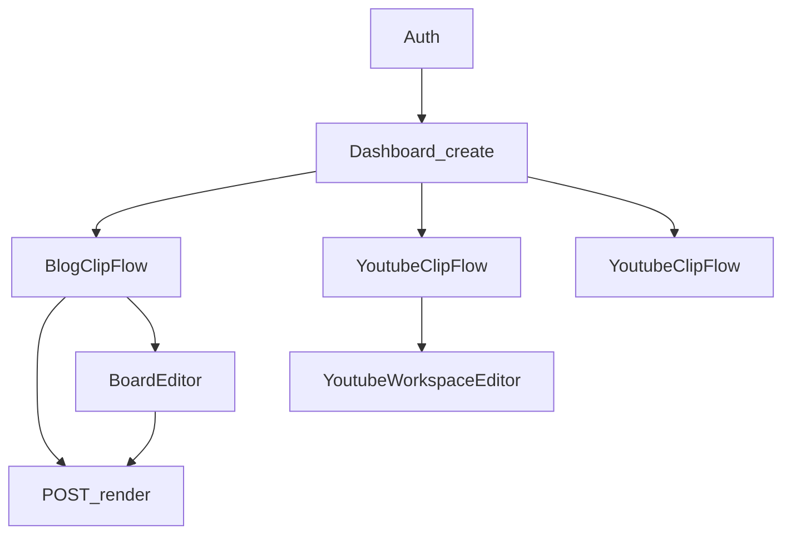
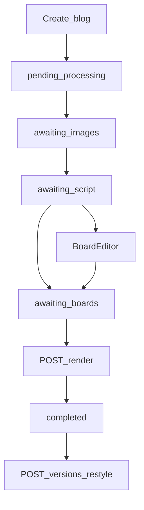
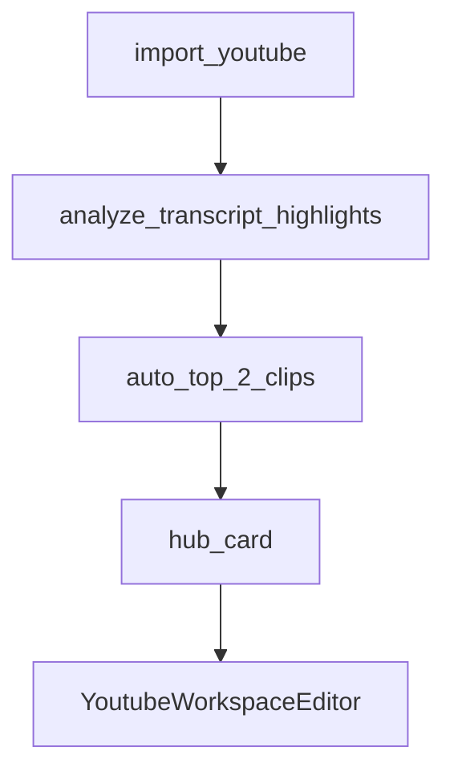

# User Journeys — New Cut

| | |
|---|---|
| **Audience** | 프로세스·UX 개선을 논의하는 AI / 사람 |
| **Snapshot** | 2026-08 (frontend UX = source of truth) |
| **Out of scope** | API 스키마 상세, Remotion/FFmpeg 내부, 배포·인프라 |
| **Related** | [ARCHITECTURE.md](ARCHITECTURE.md), [API_SPEC.md](API_SPEC.md), [PROJECT_STATUS.md](PROJECT_STATUS.md), [WIZARD_DESIGN.md](WIZARD_DESIGN.md) (**스태레**) |

이 문서는 **현재 구현된 사용자 여정**만 적는다. 목표 설계와 섞지 않는다.

> **스태레 주의:** `WIZARD_DESIGN.md`는 보드→보이스→스타일 선형 위자드와 `edit_mode` 포크를 서술한다. 실제 제품은 블로그에서 **이미지·대본만 고른 뒤 기본값으로 렌더**하고, 완료 화면에서 템플릿·보이스를 restyle 버전으로 바꾼다.

---

## 1. 글로벌 IA

### 1.1 로그인 이후 셸

1. `login` / `register` → JWT (`localStorage`) → `dashboard`
2. `StudioShell` 레일 탭 (`StudioTab`):
   - `create` — 만들기 (CreateStudio)
   - `projects` — 프로젝트 (9:16 카드 그리드)
   - `usage` — 요금제 (MembershipPage)

### 1.2 App 전체 화면 우선순위

[`App.tsx`](../frontend/src/App.tsx)가 아래 순서로 **한 화면만** 렌더한다.

1. `editingYoutubeClip` → `YoutubeWorkspaceEditor`
2. `editingBlogClip` + status `awaiting_boards` → `BoardEditor`
3. `focusYoutubeVideo` → `YoutubeClipFlow`
4. `focusBlogClip` → `BlogClipFlow`
5. 그 외 → `Dashboard`

### 1.3 URL 해시

| 해시 | 의미 |
|------|------|
| `#/studio/create\|projects\|usage` | 스튜디오 탭 |
| `#/shorts/{id}` | 블로그 쇼츠 플로우 포커스 |
| `#/shorts/{id}/edit` | 블로그 BoardEditor |
| `#/videos/{id}` | 유튜브·MP4 가이드 플로우 (`YoutubeClipFlow`) |
| `#/clips/{id}/edit` | 유튜브·MP4 세부 편집 (`YoutubeWorkspaceEditor`) |

---

## 2. Journey A — 블로그 → 쇼츠

**진입:** CreateStudio 소스 `blog`/`product` → “쇼츠 만들기” → `POST /blog-clips` → `focusBlogClip` → `BlogClipFlow`

**핵심 컴포넌트:**  
`CreateStudio.tsx`, `BlogClipFlow.tsx`, `ImageSelectStep.tsx`, `BoardEditor.tsx`, `CompletedShortPlayer.tsx`, `BlogClipVersionsPanel.tsx`

만들기 화면의 길이·언어·자막·모델은 **세부 설정**으로 접혀 있다. 기본값: `short` / `original` / `shorts` / `gpt-4o-mini`.

### 2.1 서버 status → UI

| `BlogClipStatus` | 사용자 화면 |
|------------------|-------------|
| `pending` / `processing` | 준비/렌더 진행 바 |
| `awaiting_images` | 이미지 선택 (최소 3 · 최대 8) |
| `awaiting_script` | 대본 톤 선택. 기본 CTA는 렌더, 보조는 보드 직접 편집 |
| `awaiting_boards` | 자동 렌더 시작 (보드 에디터에서 돌아온 경우 포함) |
| `completed` | 플레이어 · 다운로드 · restyle · 버전 |
| `failed` | 실패 메시지 |

**가로 진행 바** (`FLOW_STEPS`): `준비` → `이미지` → `대본` → `완료`

Phase-2 렌더 UI: status가 `pending`/`processing`이고 `progress_percent >= 55` 이거나 stage가 synthesizing/rendering/burning일 때 “렌더 중”.

### 2.2 대본 이후

톤 선택 → 보드 생성 → `awaiting_boards` → `POST /render`.  
보드 직접 편집은 대본 화면의 보조 링크로 `BoardEditor`를 연다. 편집 완료 시 확인 카드 없이 렌더한다.

완료 후 템플릿·보이스·BGM 변경은 `POST /blog-clips/{id}/versions` `mode=restyle` (부모 clip 상태는 `completed` 유지, 활성 버전만 교체).

---

## 3. Journey B — 유튜브 → 클립

**진입:** CreateStudio 소스 `youtube` → URL 확인(같은 패널 인라인) → 템플릿 선택 → `POST /videos/import-youtube` → `YoutubeClipFlow`

**핵심 컴포넌트:** `YoutubeClipFlow.tsx`, `YoutubeWorkspaceEditor.tsx`

### 3.1 진행 바

`분석` → `생성` → `완료`

하이라이트를 사용자가 고르지 않는다. 점수 상위 **2편**을 자동 생성한 뒤 허브 카드에서 워크스페이스로 들어간다.

---

## 4. Journey C — MP4

CreateStudio 업로드 → 유튜브와 동일하게 `YoutubeClipFlow`.  
Projects → **고급**의 `VideoList`는 수동 재작업용.

---

## 5. Journey D — 프로젝트 재개

Dashboard → `projects` (9:16 썸네일 그리드).

| 뷰 | 이어하기 |
|----|----------|
| `작업 중` | 블로그 → Flow/보드 편집; 영상 → `YoutubeClipFlow` |
| `완료` | 블로그 → 결과 Flow; 클립 → `YoutubeWorkspaceEditor` |
| `고급` | 고전 `VideoList` + `ClipsLibrary` |

---

## 6. Journey E — 요금제 · 크레딧

Dashboard → `usage` → `MembershipPage`. 표시 전용.

**크레딧(+1) 시점:** 비디오 **Analyze** 성공 시. restyle 버전 생성은 현재 차감하지 않는다.

---

## 7. 성공 기준 체크리스트

### 블로그 쇼츠

- [ ] 이미지 확정 → 톤 선택 → 렌더
- [ ] `completed` + 인앱 재생
- [ ] MP4 다운로드
- [ ] (선택) restyle 버전 · 메타데이터 · 활성 버전

### 유튜브 / 클립

- [ ] 인라인 확인 후 자동 2편 생성
- [ ] 클립 `completed` + 워크스페이스 편집
- [ ] 다운로드

---

## 8. 개선 논의용 관찰점 (현상만)

1. 유튜브·MP4 해시 `#/videos/{id}`, `#/clips/{id}/edit`
2. 보드 편집은 여전히 `awaiting_boards`에서만 가능 (완료 후 보드는 `mode=boards` 버전)
3. 프로젝트 목록은 클라이언트 어댑터; `GET /projects`는 프론트에서 미사용
4. 멤버십 UI만 — 결제 없음
5. 크레딧은 Analyze만 +1; 블로그 렌더·restyle은 미차감

---

## 9. 주요 파일 인덱스

| 역할 | 경로 |
|------|------|
| 오케스트레이션 | `frontend/src/App.tsx` |
| 셸 | `frontend/src/components/StudioShell.tsx` |
| 소스 선택 | `frontend/src/components/CreateStudio.tsx` |
| 블로그 플로우 | `frontend/src/components/BlogClipFlow.tsx` |
| 블로그 세부 편집 | `frontend/src/components/board/BoardEditor.tsx` |
| 유튜브 플로우·편집 | `YoutubeClipFlow.tsx`, `YoutubeWorkspaceEditor.tsx` |
| 프로젝트 | `ProjectsPage.tsx`, `projectAdapters.ts` |
